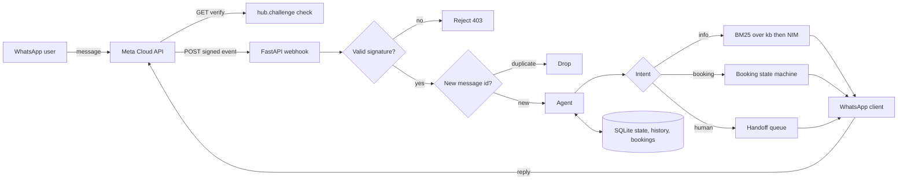
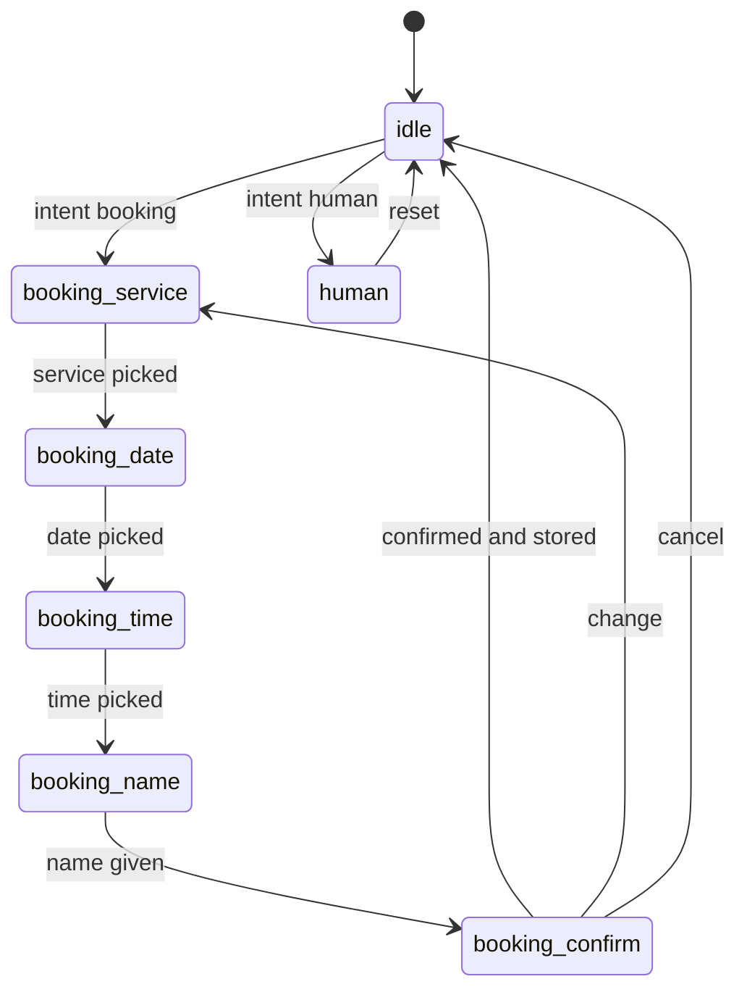

# whatsapp-ai-agent

**A WhatsApp AI agent on the Meta Cloud API — signature-verified webhook, FAQ answering over your knowledge base, and a stateful appointment-booking flow with human handoff. Bilingual EN/ES, built for LATAM small businesses.**

[](LICENSE)
[](https://www.python.org/)
[](https://fastapi.tiangolo.com/)
[](https://developers.facebook.com/docs/whatsapp/cloud-api)
[](https://build.nvidia.com)

A small business messages its customers on WhatsApp, not email. This is a complete, production-shaped WhatsApp Business agent: it verifies Meta's webhook signatures, answers FAQs by retrieving from your own knowledge base, books appointments through native WhatsApp buttons and lists, and hands off to a human the moment it should. It speaks Spanish and English, and it runs on a free NVIDIA NIM key — or with no LLM at all.

## Why

Most "WhatsApp bot" samples stop at echoing a text message. Real deployments need the unglamorous parts: constant-time signature verification, idempotency for Meta's webhook retries, interactive replies instead of "type 1 for X", a conversation that remembers where it is, and a clean exit to a human. This repo is those parts, wired together on FastAPI, with a booking flow you can actually put in front of customers.

It is framed for a Panama / LATAM small business — a barbershop with a bilingual clientele — but the knowledge base and service catalog are two files you edit.

## Features

- **Signature-verified webhook.** Every `POST` is checked against `X-Hub-Signature-256` (HMAC-SHA256 over the raw body) in constant time. GET verification handles Meta's `hub.challenge` handshake.
- **Idempotent ingestion.** WhatsApp retries webhooks; message ids are recorded in SQLite and duplicates are dropped before they reach the agent.
- **FAQ answering over your KB.** Markdown articles in `kb/` are indexed with BM25 (pure Python, no embeddings service) and passed to the LLM as grounding context. No key? It returns the best-matching snippet directly.
- **Stateful appointment booking.** A explicit state machine collects service, date, time and name using WhatsApp interactive lists and buttons, checks the slot against existing bookings, and stores confirmed appointments.
- **Human handoff.** Complaints, unclear requests, or image messages flip a handoff flag, queue the conversation for a person, and tell the customer someone will follow up — then the bot stays quiet so it never talks over your staff.
- **Bilingual.** Language is detected per message and every fixed string ships in EN and ES; the LLM answers in the customer's language.
- **Voice notes.** Inbound audio is downloaded and transcribed with faster-whisper when installed; otherwise the bot politely asks the customer to type.
- **Offline-friendly and testable.** A fake WhatsApp client and a stub LLM drive the whole flow in tests with no network. A local signer script exercises the real webhook without Meta.

## Architecture



The webhook returns `200` immediately and processes each message in a FastAPI background task, so a slow LLM call never trips Meta's retry timeout.

## Booking flow



## Quickstart

```bash
git clone https://github.com/AleBrito124356/whatsapp-ai-agent.git
cd whatsapp-ai-agent

python -m venv .venv
# Windows: .venv\Scripts\activate
source .venv/bin/activate

pip install -r requirements.txt
cp .env.example .env          # then edit .env
```

Fill in `.env`:

- `WHATSAPP_TOKEN`, `WHATSAPP_PHONE_NUMBER_ID`, `WHATSAPP_APP_SECRET`, `WHATSAPP_VERIFY_TOKEN` — from the Meta app dashboard. Full walkthrough in [docs/meta-setup.md](docs/meta-setup.md).
- `NVIDIA_API_KEY` — get a free key at [build.nvidia.com](https://build.nvidia.com) (it starts with `nvapi-`). Leave the placeholder to run in offline mode.

Run it:

```bash
uvicorn app.main:app --reload --port 8000
```

Expose it over HTTPS (Meta requires it) and point your webhook at `https://<host>/webhook`:

```bash
ngrok http 8000
```

## Usage

**Health check**

```bash
curl -s localhost:8000/health
```

```json
{"status":"ok","business":"Barbería Studio Norte","llm":"nim","signature_verification":true}
```

**Drive the agent locally — no phone, no tunnel.** The tester signs the payload with your `WHATSAPP_APP_SECRET`, so it passes the real verification path:

```bash
python scripts/send_webhook.py "hola, cuánto cuesta un corte?"
# -> POST http://localhost:8000/webhook -> 200
# server sends: "Un corte de cabello cuesta $12 e incluye lavado y peinado..."

python scripts/send_webhook.py "quiero una cita"
# -> bot replies with an interactive list of services

python scripts/send_webhook.py --interactive svc:svc_corte "Corte de cabello"
# -> bot replies with an interactive list of available days

python scripts/send_webhook.py "necesito hablar con una persona"
# -> bot sets handoff and replies that a team member will follow up
```

**Run the tests** (all offline):

```bash
pytest -q
# ....................                                             [100%]
```

**Docker**

```bash
docker build -t whatsapp-ai-agent .
docker run --env-file .env -p 8000:8000 whatsapp-ai-agent
```

## Configuration

Edit two files to make it yours:

- `kb/*.md` — your FAQ content. Add, remove or rewrite articles; the retriever picks them up on startup.
- `app/catalog.py` — the service menu, weekly opening hours, and every bilingual UI string.

Business identity comes from `.env` (`BUSINESS_NAME`, `BUSINESS_PHONE`, `BUSINESS_TIMEZONE`). Swap the model with `NIM_MODEL` (defaults to `meta/llama-3.3-70b-instruct`).

## Project structure

```
whatsapp-ai-agent/
├── app/
│   ├── main.py          # FastAPI app + health endpoints
│   ├── webhook.py       # GET verify, POST receive, payload parsing, dedupe
│   ├── security.py      # X-Hub-Signature-256 verification
│   ├── agent.py         # intent routing, FAQ RAG, booking state machine, handoff
│   ├── state.py         # conversation state machine + message history (SQLite)
│   ├── db.py            # SQLite plumbing: connection, schema, dedupe, bookings, handoffs
│   ├── kb.py            # markdown loader + BM25 retriever
│   ├── llm.py           # NVIDIA NIM client (OpenAI-compatible)
│   ├── wa_client.py     # Graph API sender: text, images, lists, buttons, media
│   ├── catalog.py       # services, hours, bilingual strings
│   ├── transcribe.py    # optional faster-whisper voice-note transcription
│   ├── models.py        # InboundMessage dataclass
│   ├── config.py        # env-driven settings
│   └── deps.py          # app singletons
├── kb/                  # 8 markdown FAQ articles (ES)
├── data/schema.sql      # SQLite schema (the .sqlite file is generated)
├── docs/meta-setup.md   # end-to-end Meta Cloud API setup
├── scripts/send_webhook.py  # signed local webhook tester
├── tests/               # signature, retriever, parsing, full booking flow
├── Dockerfile
├── requirements.txt
└── .env.example
```

## Compliance notes

WhatsApp is not email — the rules are stricter, and ignoring them gets your number restricted.

- **Opt-in.** Only message people who opted in. A user messaging you first opens the window; this agent only ever *responds*.
- **The 24-hour window.** Inside 24 hours of the user's last message you can reply freely. Outside it, you must use a **pre-approved message template** — that is how appointment reminders and promotions must be sent. See [docs/meta-setup.md](docs/meta-setup.md#7-the-24-hour-customer-service-window).
- **Templates for proactive messages.** Confirming a booking in-chat is free-form; a next-day reminder is a template. This repo focuses on the in-window conversation and documents where templates plug in.
- **Easy opt-out.** Always honor "BAJA" / "STOP".

## Why this fits LATAM SMBs

In Panama and across Latin America, WhatsApp *is* the customer channel — a barbershop, dental clinic or workshop lives on it. But the owner is cutting hair, not staffing a chat. This agent answers the same ten questions all day (prices, hours, location), books the appointment with taps instead of a phone call, and pulls in a human for anything real — in Spanish or English, on infrastructure that costs nothing to run on a free NIM key. It is small enough to read in an afternoon and shaped like something you would actually deploy.

## Related projects

Part of a series of AI agent and automation blueprints by [@AleBrito124356](https://github.com/AleBrito124356):

- [**support-agent-stack**](https://github.com/AleBrito124356/support-agent-stack) — Complete customer-support AI agent with RAG; the natural next layer under this bot.
- [**telegram-ai-agents**](https://github.com/AleBrito124356/telegram-ai-agents) — The same ideas on Telegram: assistant, PDF-RAG, and vision bots.
- [**voice-agent-starter**](https://github.com/AleBrito124356/voice-agent-starter) — Local voice assistant with whisper + NIM + edge-tts; the voice-note transcription here links to it.
- [**rag-blueprints**](https://github.com/AleBrito124356/rag-blueprints) — 8 RAG architectures if you want to grow the FAQ retriever beyond BM25.

---

## Español

**Un agente de IA para WhatsApp sobre la Meta Cloud API.** Webhook con verificación de firma, respuestas a preguntas frecuentes sobre tu base de conocimiento, y un flujo de reserva de citas con estado y traspaso a un humano. Bilingüe (ES/EN), pensado para pymes de LATAM.

### Qué hace

- **Verifica la firma** `X-Hub-Signature-256` de cada webhook (HMAC-SHA256 sobre el cuerpo crudo) y responde el `hub.challenge` en la verificación GET.
- **Evita duplicados** guardando el id de cada mensaje en SQLite (Meta reintenta los webhooks).
- **Responde FAQs** recuperando de `kb/` con BM25 y pasando el contexto al modelo (NVIDIA NIM). Sin API key, devuelve el fragmento más relevante.
- **Agenda citas** con listas y botones nativos de WhatsApp: servicio, día, hora y nombre, con confirmación; verifica el horario contra las reservas existentes.
- **Traspasa a un humano** ante quejas, imágenes o casos poco claros: marca la conversación, la encola y avisa al cliente que una persona le escribirá.
- **Bilingüe**: detecta el idioma por mensaje y responde en español o inglés.

### Por qué encaja en pymes de LATAM

En Panamá y toda la región, WhatsApp *es* el canal de atención. Una barbería, clínica o taller vive ahí, pero el dueño está trabajando, no atendiendo el chat. Este agente responde las mismas preguntas de siempre (precios, horarios, ubicación), agenda la cita con toques en lugar de una llamada, y llama a una persona para lo que de verdad lo necesita — en español o inglés, corriendo gratis sobre una key de NIM.

### Cómo empezar

```bash
git clone https://github.com/AleBrito124356/whatsapp-ai-agent.git
cd whatsapp-ai-agent
pip install -r requirements.txt
cp .env.example .env     # completa tus credenciales
uvicorn app.main:app --reload
```

Consigue tu key gratuita de NVIDIA NIM en [build.nvidia.com](https://build.nvidia.com) (empieza con `nvapi-`). La guía completa de Meta está en [docs/meta-setup.md](docs/meta-setup.md).

### Cumplimiento

Respeta el **opt-in**, la **ventana de 24 horas** (fuera de ella solo puedes enviar **plantillas aprobadas**) y ofrece siempre una salida ("responde BAJA"). Detalles en [docs/meta-setup.md](docs/meta-setup.md).

---

## License

MIT © 2026 Alejandro Brito. See [LICENSE](LICENSE).
