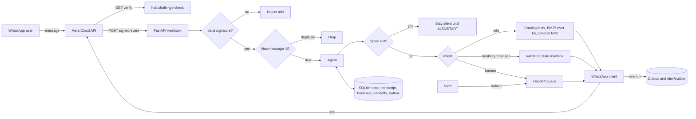
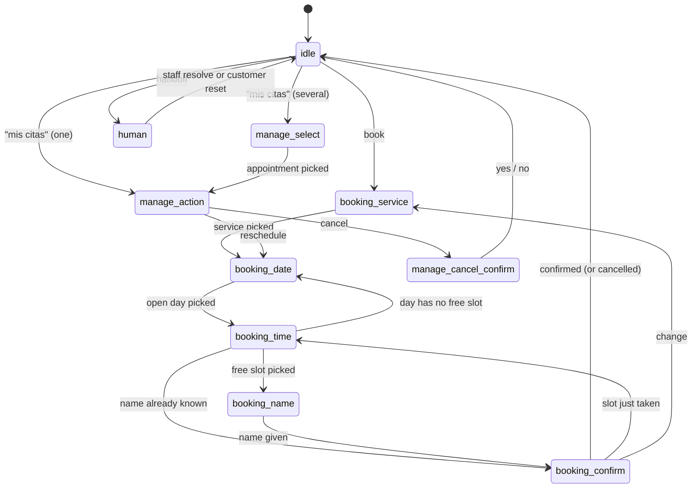

# whatsapp-ai-agent

**A WhatsApp AI agent on the Meta Cloud API. It has a signature-verified webhook, FAQ answers from your catalog and knowledge base, a validated and race-safe booking flow with self-service cancel and reschedule, and a human handoff that staff can actually work. It is bilingual (ES/EN) and built for LATAM small businesses.**

[](LICENSE)
[](https://www.python.org/)
[](https://fastapi.tiangolo.com/)
[](https://developers.facebook.com/docs/whatsapp/cloud-api)
[](https://build.nvidia.com)

Small businesses talk to their customers on WhatsApp, not email. This is a complete, production-shaped WhatsApp Business agent. It:

- verifies Meta's webhook signatures,
- answers prices and opening hours exactly from your service catalog, and other questions from your own knowledge base,
- books, reschedules and cancels appointments through native WhatsApp buttons and lists,
- hands the chat to a person whenever a person should take over.

It speaks Spanish and English. It runs on a free NVIDIA NIM key or with no LLM at all, and you can try all of it in your terminal before you create a Meta app.

## Try it in one minute (no Meta account, no keys)

```bash
git clone https://github.com/AleBrito124356/whatsapp-ai-agent.git
cd whatsapp-ai-agent
python -m venv .venv && source .venv/bin/activate   # Windows: .venv\Scripts\activate
pip install -r requirements.txt

python -m app chat          # talk to the real agent; type a number to tap a button
```

`python -m app chat` runs the real agent against a throwaway SQLite database. It prints each outgoing message exactly as it would reach WhatsApp. Nothing is sent to Meta, whatever credentials your environment holds. The LLM is used only when `NVIDIA_API_KEY` is set and you don't pass `--offline`. The test suite replays the four example conversations below (`tests/test_cli.py`) and checks that they match the files in `tests/golden/` byte for byte:

```bash
python -m app chat --offline --now 2026-09-24T09:00 --script examples/booking_es.txt
python -m app chat --offline --now 2026-09-24T09:00 --script examples/faq_en.txt
python -m app chat --offline --now 2026-09-24T09:00 --script examples/manage_en.txt
python -m app chat --offline --now 2026-09-24T09:00 --script examples/handoff_es.txt
```

In this excerpt from `examples/booking_es.txt` the customer asks a question mid-booking. The bot answers from the catalog and goes back to the same step. Friday has 11 slots but a WhatsApp list only holds 10 rows, so the times are paginated:

<!-- transcript: booking_es -->
```text
you › ¿cuánto cuesta el corte + barba?
bot › ✂️ Corte + barba: $18 · 45 min

      Pregunta también por nuestras *promociones*. Para reservar, escribe *reservar*. 💈
bot › ¿Para qué día? Estos son los próximos días disponibles:
      ☰ Elegir día
        1) Jue 24 sep · Hoy
        2) Vie 25 sep · Mañana
```

<!-- transcript: booking_es -->
```text
       10) Más horarios ➡️ · Después de las 17:00
you › [Más horarios ➡️]
bot › ¿A qué hora te viene bien el Vie 25 sep?
      ☰ Elegir hora
        1) 18:00
        2) 19:00
```

## Features

- **Signature-verified webhook.** Every `POST` is checked against `X-Hub-Signature-256` (HMAC-SHA256 over the raw body) in constant time. GET verification handles Meta's `hub.challenge` handshake.
- **Idempotent ingestion.** WhatsApp retries webhooks. Message ids are recorded in SQLite, and duplicates are dropped before they reach the agent. Messages from one contact are processed one at a time.
- **A booking state machine that really is one.** Every state change is checked against the transition table in `app/state.py`. Each button or list reply is accepted only in the step that sent it, and its value is checked again against the live calendar: the day is open, it is not in the past, it is at most 21 days ahead, and the slot is real and still free. A stale or forged button gets *"Esa opción ya no está disponible"* and the current step is shown again.
- **Race-safe slots.** A partial `UNIQUE` index allows only one confirmed booking per date and time. If two customers confirm 10:00 at the same moment, one wins. The other is told the slot was just taken and gets the remaining times, and the name they already entered is kept.
- **Self-service "Mis citas / My appointments".** A customer can list upcoming bookings, cancel one (with a confirmation step), or reschedule it. Rescheduling keeps the service and the name, and moves the booking in one atomic update. Customers can reach it by typing things like *"cancelar mi cita"*, *"I need to reschedule"* or *"mis citas"*, or from the menu.
- **Typed answers work too.** At each step you can type instead of tapping: "2", "10am", "mañana", "sábado", "sí" and "cancelar" are understood. A question asked in the middle of a booking is answered, and then the booking picks up at the same step.
- **Exact answers for prices and hours.** `app/catalog.py` is the source of truth. "¿Cuánto cuesta un corte?" gets `✂️ Corte de cabello: $12 · 30 min`, and "what time do you close on friday?" gets the real Friday hours, both in the customer's language. Tests fail if `kb/prices.md`, `kb/services.md` or `kb/hours.md` drift from the catalog.
- **Bilingual FAQ retrieval over your knowledge base.** It uses BM25 in pure Python with accent folding, light ES/EN stemming, a heading boost and an editable bilingual glossary (`kb/_lexicon.json`). On 40 labelled questions (20 ES, 20 EN) top-1 accuracy went from **18/40** in the first release (3/20 in English) to **38/40**. Offline, an English question is answered with the matching knowledge-base section, which is written in Spanish. With an LLM configured, the answer is written in the customer's language and grounded on the catalog facts plus the retrieved sections.
- **Human handoff that staff can work.** Complaints, requests for a person, and photos are queued. The bot then stays quiet. Staff see the queue and the transcript, reply through the same WhatsApp number, and give the chat back to the bot through `/admin`. The API enforces WhatsApp's 24-hour window.
- **Compliance built in.** BAJA, STOP, UNSUBSCRIBE and "darme de baja" opt the contact out. They get one confirmation and nothing afterwards, not even read receipts, until they send ALTA or START. A question the bot cannot answer offers a person instead of muting the bot.
- **Bilingual.** The language is inferred from free text only. Neutral input such as names, times, dates or button taps never switches it. Every fixed string ships in ES and EN.
- **Dry-run mode.** When WhatsApp credentials are missing, or are the `.env.example` placeholders, replies go to a local outbox (`GET /dev/outbox`) and never to graph.facebook.com. `scripts/send_webhook.py` prints the bot's actual answer. If `ADMIN_TOKEN` is set, the outbox requires it too.
- **Voice notes.** Inbound audio is transcribed with faster-whisper when it is installed. Otherwise the bot asks the customer to type. Media download needs live credentials.

## Architecture



The webhook returns `200` immediately and processes each message in a FastAPI background task. A slow LLM call therefore never trips Meta's retry timeout.

## Booking and appointment flows



Any state can go back to `idle` (reset, cancel, opt-out) or to `human`. The booking and "my appointments" flows can be restarted from anywhere except `human`. Everything else must follow the table in `app/state.py`.

## Quickstart with a server

**1. Offline (dry-run).** You need no credentials; copying `.env.example` as it is still keeps you offline:

```bash
cp .env.example .env
uvicorn app.main:app --port 8000
```

```bash
curl -s localhost:8000/health
```

```json
{"status":"ok","business":"Barbería Studio Norte","llm":"offline","whatsapp":"dry_run","dry_run":true,"signature_verification":true,"admin_api":false}
```

Drive it with the signed tester. It POSTs a correctly signed webhook, waits until the agent has handled it, and prints the reply from `/dev/outbox`. Under each option it also prints the command that taps it:

```bash
python scripts/send_webhook.py "quiero una cita"
python scripts/send_webhook.py --interactive svc:svc_corte "Corte de cabello"
python scripts/send_webhook.py --button confirm:yes "Confirmar ✅"
```

```text
POST http://localhost:8000/webhook -> 200 {"status":"received","accepted":1}
bot › Perfecto. ¿Qué servicio te gustaría reservar?
      ☰ Ver servicios
        1) Corte de cabello · $12 · 30 min
        ...
      ↳ 1: --interactive svc:svc_corte "Corte de cabello"
```

**2. Live.** Fill in `.env` with real values: `WHATSAPP_TOKEN`, `WHATSAPP_PHONE_NUMBER_ID`, `WHATSAPP_APP_SECRET` and `WHATSAPP_VERIFY_TOKEN`. [docs/meta-setup.md](docs/meta-setup.md) walks through it. Optionally add `NVIDIA_API_KEY`, a free key from [build.nvidia.com](https://build.nvidia.com), and `ADMIN_TOKEN` for the staff API. Then expose the server over HTTPS and point the Meta webhook at `https://<host>/webhook`:

```bash
uvicorn app.main:app --port 8000
ngrok http 8000
```

**Docker**

```bash
docker build -t whatsapp-ai-agent .
docker run --env-file .env -p 8000:8000 whatsapp-ai-agent
```

## FAQ, offline, in English

From `examples/faq_en.txt`. Prices and hours come from the catalog, and the rest comes from the knowledge base:

<!-- transcript: faq_en -->
```text
you › how much is a haircut?
bot › ✂️ Haircut: $12 · 30 min

      Ask about our *promotions* too. To book, type *book*. 💈
you › what time do you close on friday?
bot › 🕐 On Friday we're open from 9:00 a.m. to 8:00 p.m. (last appointment: 7:00 p.m.).
you › where are you located?
bot › Here's what I found:

      *Dirección*

      Barbería Studio Norte
      Calle 50, Edificio Costa del Este, local 3
      Ciudad de Panamá, Panamá
```

When nothing matches, the bot does not open a handoff by itself. It asks whether the customer wants a person:

<!-- transcript: faq_en -->
```text
you › do you sell guitars?
bot › I couldn't find anything about that. Would you like me to connect you with someone from the Barbería Studio Norte team?
      [1] Talk to a person   [2] Menu
```

## Staff workflow (human handoff)

Set `ADMIN_TOKEN` to a long random value (`python -c "import secrets; print(secrets.token_urlsafe(32))"`) and send it as a bearer token. Without `ADMIN_TOKEN`, every `/admin` endpoint answers `503`. A wrong token gets `401`.

| Endpoint | What it does |
| --- | --- |
| `GET /admin/handoffs` | Open queue: who, why, since when, the 24h window status and the last messages. |
| `GET /admin/conversations/{wa_id}` | Full transcript (`customer` / `bot` / `staff`), state, draft and bookings. |
| `POST /admin/conversations/{wa_id}/reply` `{"text": "..."}` | Sends through the same WhatsApp number and logs it as `staff`. If the conversation was not handed off yet, this takes it over, so the bot stays quiet. |
| `POST /admin/handoffs/{wa_id}/resolve` `{"notify": true}` | Closes the queue entry, turns the bot back on, and optionally tells the customer. |
| `GET /admin/bookings?date=YYYY-MM-DD&status=confirmed\|cancelled\|conflict\|all` | Bookings for a day. Without a date it lists bookings from today on. |
| `POST /admin/bookings/{id}/cancel` `{"notify": true}` | Cancels the booking and notifies the customer when it is allowed. |

```bash
curl -s -H "Authorization: Bearer $ADMIN_TOKEN" localhost:8000/admin/handoffs
curl -s -X POST -H "Authorization: Bearer $ADMIN_TOKEN" -H "Content-Type: application/json" \
     -d '{"text":"Hola Ana, soy Carlos. ¿En qué te ayudo?"}' localhost:8000/admin/conversations/50760001234/reply
curl -s -X POST -H "Authorization: Bearer $ADMIN_TOKEN" localhost:8000/admin/handoffs/50760001234/resolve
```

WhatsApp's rules are enforced, not just documented:

- **24-hour window.** Free-form messages are allowed only within 24 hours of the customer's last message. Outside the window, a reply returns `409 template_required` with an explanation, because Meta requires an approved template there.
- **Opt-out.** Nobody can message a contact who sent BAJA or STOP (`409 opted_out`).
- **Delivery errors.** If the Graph API rejects a staff message you get `502`, and the message is not logged as sent.

You can rehearse all of this in the simulator with `/staff`, `/resolve`, `/queue` and `/advance 25h`. From `examples/handoff_es.txt`:

<!-- transcript: handoff_es -->
```text
you › necesito hablar con una persona
bot › Con gusto. Un miembro del equipo de Barbería Studio Norte continuará esta conversación contigo lo antes posible. 🙌 Mientras tanto puedes dejar tu mensaje aquí.
you › ¿hola? ¿sigue alguien ahí?
   1 open handoff(s)
   - 50760001234 Ana reason=requested
staff › Hola Ana, soy Carlos del equipo. ¿En qué te ayudo?
```

<!-- transcript: handoff_es -->
```text
   ⏱ clock advanced 25h
   ✖ staff: template_required: Outside WhatsApp's 24-hour window (the customer last wrote 25.0 h ago). Free-form messages are not allowed; send an approved message template instead (see docs/meta-setup.md, section 7).
you › BAJA
bot › Listo, no te enviaremos más mensajes por este chat. Si cambias de opinión, escribe ALTA (o START). 👋
you › hola
you › ALTA
bot › ¡Bienvenido de vuelta! Volverás a recibir nuestras respuestas. 🙌
```

For quick looks at a database there are two views: `python -m app bookings [--date 2026-09-25] [--status all]` and `python -m app handoffs`.

## Configuration

| Variable | Default | Purpose |
| --- | --- | --- |
| `WHATSAPP_TOKEN`, `WHATSAPP_PHONE_NUMBER_ID` | empty | Graph API credentials. When they are empty or the `.env.example` placeholders, the app runs in **dry-run**. |
| `WHATSAPP_APP_SECRET` | empty | Verifies `X-Hub-Signature-256`. When it is empty, signatures are not checked, and every request logs a warning. |
| `WHATSAPP_VERIFY_TOKEN` | `change-me` | The token for Meta's GET verification handshake. |
| `WHATSAPP_DRY_RUN` | auto | `1` forces dry-run even with real credentials, for example on staging. |
| `ADMIN_TOKEN` | empty | Enables `/admin`. |
| `NVIDIA_API_KEY`, `NIM_MODEL`, `NIM_BASE_URL` | offline | Optional LLM for intent routing and grounded answers. |
| `BUSINESS_NAME`, `BUSINESS_DESCRIPTION`, `BUSINESS_PHONE`, `BUSINESS_TIMEZONE` | the sample barbershop | Identity used in messages and LLM prompts, and the timezone for the calendar. |
| `DB_PATH` | `data/bookings.sqlite` | SQLite file. Databases from older versions are migrated in place. |

The files you edit to make it yours:

- `app/catalog.py`: services (price, duration, customer aliases), weekly hours and every bilingual UI string.
- `kb/*.md`: your FAQ articles. Keep prices and hours consistent with the catalog; the tests check it.
- `kb/_lexicon.json`: the bilingual glossary that maps customers' words to your articles' words.

## Project structure

```
whatsapp-ai-agent/
├── app/
│   ├── main.py          # create_app(): webhook, /admin, /dev/outbox (dry-run), /health
│   ├── webhook.py       # GET verify, POST receive, payload parsing, dedupe
│   ├── security.py      # X-Hub-Signature-256 verification
│   ├── agent.py         # routing, booking + "my appointments" machines, FAQ, opt-out, handoff
│   ├── state.py         # states, transitions, payload rules; conversation store
│   ├── db.py            # SQLite: schema + migrations, bookings, handoffs, outbox
│   ├── facts.py         # exact price / hours answers from the catalog
│   ├── kb.py            # markdown loader + bilingual BM25 retriever
│   ├── staff.py         # staff rules: queue, reply (24h window), resolve, bookings
│   ├── admin.py         # /admin HTTP API over staff.py
│   ├── dev.py           # /dev/outbox (dry-run only)
│   ├── cli.py           # python -m app chat | bookings | handoffs
│   ├── wa_payloads.py   # Graph API payload builders + renderer
│   ├── wa_client.py     # WhatsApp client with Graph / dry-run / callback transports
│   ├── llm.py           # NVIDIA NIM client (OpenAI-compatible)
│   ├── catalog.py       # services, hours, bilingual strings
│   ├── clock.py         # injectable clocks (frozen in tests and the simulator)
│   ├── deps.py          # build_services(): wiring, nothing built at import time
│   ├── transcribe.py    # optional faster-whisper voice-note transcription
│   ├── models.py        # InboundMessage dataclass
│   └── config.py        # env-driven settings, placeholder detection
├── kb/                  # 8 markdown FAQ articles (ES) + _lexicon.json
├── examples/            # simulator scripts (their transcripts are tests/golden/*.out)
├── data/schema.sql      # SQLite schema v2 (the .sqlite file is generated)
├── docs/meta-setup.md   # end-to-end Meta Cloud API setup + staff workflow
├── scripts/send_webhook.py  # signed local webhook tester that prints the reply
├── tests/               # offline test suite (see below)
├── CHANGELOG.md
├── Dockerfile
└── requirements.txt
```

## Tests

```bash
pytest -q
```

Everything runs offline with a frozen clock, temporary databases, a fake WhatsApp client that records the real Graph payloads, and a fake LLM. The suite covers:

- the HTTP layer: verification, signatures, dedupe, the outbox, and a guard that the `.env.example` values never reach graph.facebook.com;
- every booking bug found in the first release (`tests/test_booking_rules.py`);
- the staff API and the compliance rules;
- the migration from the v1 schema;
- the retrieval eval and the catalog and knowledge-base consistency checks;
- the golden simulator transcripts. `tests/test_readme.py` checks that every transcript quoted in this README is really produced by the code.

Running `pytest` leaves the working tree clean.

## Limitations

- **One chair per slot, hourly slots.** The unique index allows exactly one confirmed booking per date and hour. A shop with several barbers needs a capacity or staff column.
- **The per-contact lock is in-process.** Run a single worker (the default `uvicorn` command) or put a shared lock in front of the agent.
- **Offline English answers quote the Spanish knowledge base**, except for prices and hours, which come from the catalog. With an LLM, answers are in the customer's language.
- **No outbound templates yet.** Appointment reminders outside the 24-hour window need approved templates. The staff API refuses free-form messages there instead of pretending to send them.

## Compliance notes

WhatsApp is not email. Its rules are stricter, and ignoring them gets your number restricted.

- **Opt-in.** Only message people who opted in. When a user messages you first, the window opens; the bot itself only ever *responds*.
- **The 24-hour window.** Within 24 hours of the user's last message you can reply freely. Outside it you must use a **pre-approved message template**. The staff API enforces this; see [docs/meta-setup.md](docs/meta-setup.md#7-the-24-hour-customer-service-window).
- **Templates for proactive messages.** Confirming a booking in the chat is a free-form message. A reminder the next day must be a template.
- **Easy opt-out.** BAJA, STOP, UNSUBSCRIBE and "darme de baja" are honored immediately, and ALTA or START opts the contact back in.

## Why this fits LATAM SMBs

In Panama and across Latin America, WhatsApp *is* the customer channel. A barbershop, a dental clinic or a workshop lives on it, but the owner is cutting hair, not staffing a chat. This agent:

- answers the same ten questions all day (prices, hours, location) with the real numbers,
- books, moves and cancels appointments with taps instead of a phone call,
- brings in a person for anything that needs one, and gives that person a proper console.

It does this in Spanish or English, on infrastructure that costs nothing to run. It is small enough to read in an afternoon and shaped like something you would actually deploy.

## Related projects

Part of a series of AI agent and automation blueprints by [@AleBrito124356](https://github.com/AleBrito124356):

- [**support-agent-stack**](https://github.com/AleBrito124356/support-agent-stack): a complete customer-support AI agent with RAG, and the natural next layer under this bot.
- [**telegram-ai-agents**](https://github.com/AleBrito124356/telegram-ai-agents): the same ideas on Telegram, with assistant, PDF-RAG and vision bots.
- [**voice-agent-starter**](https://github.com/AleBrito124356/voice-agent-starter): a local voice assistant with whisper, NIM and edge-tts. The voice-note transcription here links to it.
- [**rag-blueprints**](https://github.com/AleBrito124356/rag-blueprints): 8 RAG architectures, if you want to grow the FAQ retriever beyond BM25.

---

## Español

**Un agente de IA para WhatsApp sobre la Meta Cloud API.** Tiene webhook con verificación de firma, respuestas exactas de precios y horarios, preguntas frecuentes sobre tu base de conocimiento, reservas validadas con cancelación y reprogramación, y traspaso a una persona con consola para el equipo. Es bilingüe (ES/EN) y está pensado para pymes de LATAM.

### Pruébalo en un minuto (sin cuenta de Meta ni claves)

```bash
pip install -r requirements.txt
python -m app chat      # conversa con el agente real; escribe un número para tocar un botón
python -m app chat --offline --now 2026-09-24T09:00 --script examples/booking_es.txt
```

### Qué hace

- **Verifica la firma** `X-Hub-Signature-256` de cada webhook y responde el `hub.challenge`. Además descarta los mensajes duplicados, porque Meta reintenta los webhooks.
- **Agenda citas con reglas reales.** Cada botón solo vale en el paso que lo envió. El día y la hora se validan contra el horario, y un índice único impide que dos clientes reserven la misma hora. Si pasa, el segundo recibe «alguien acaba de reservar» y elige otra hora. El viernes muestra también las 19:00, porque los horarios se paginan.
- **Mis citas.** Con escribir «cancelar mi cita», «reprogramar» o «mis citas», el cliente puede cancelar o mover su cita sin llamar.
- **Precios y horarios exactos**, sacados de `app/catalog.py`. El resto de preguntas se responde con la base de conocimiento: BM25 bilingüe con un glosario editable (`kb/_lexicon.json`) y 95 % de acierto en 40 preguntas etiquetadas.
- **Traspaso a una persona que sí funciona.** El equipo ve la cola, lee la conversación, responde desde el mismo número y devuelve el chat al bot desde `/admin`. La API respeta la ventana de 24 horas y las bajas.
- **BAJA / ALTA.** Tras un «BAJA» el bot no vuelve a escribir, ni siquiera marca los mensajes como leídos, hasta recibir «ALTA».
- **Modo dry-run.** Sin credenciales reales, o con las de `.env.example`, no se envía nada a Meta: las respuestas quedan en `/dev/outbox`, y `scripts/send_webhook.py` las muestra.

### Cumplimiento

Respeta el **opt-in** y la **ventana de 24 horas**: fuera de ella solo puedes enviar **plantillas aprobadas**, y la API del equipo lo impide. Las **bajas** (BAJA / STOP) se aplican al instante. Más detalles en [docs/meta-setup.md](docs/meta-setup.md).

---

## License

MIT © 2026 Alejandro Brito. See [LICENSE](LICENSE).
